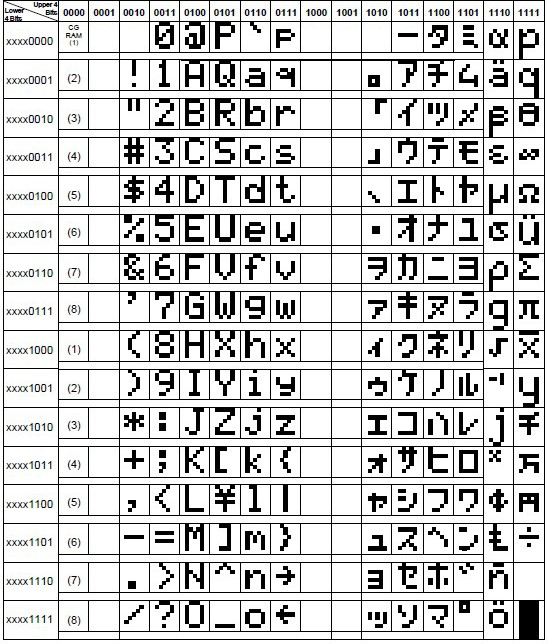

# LBB2020Gift
Documentation for setting up LCD display 1602 (controller HD44780) with Raspberry Pi and code for the gift to Adam and Elena.

## Instructions on adding your code for LBBers (PLEASE READ THIS)

1. Git clone this repository.
2. Go into the `msg` folder. Make a copy of the `sample` folder and rename it to your name.
3. Edit the customisable part in `msg.py` file to put your messages. Do NOT change the file name `msg.py` or the function name `get_msg_list`.
4. Feel free to get creative! You may use animations in the way shown in the sample, or use symbols (ASCII 0 - 255) to draw pictures.   
5. When you are done, run `git pull` first to ensure you have the most up-to-date repo, and do `git push` to commit your code. 

NEW NOTE: It is found that the screen only supports the following character set (read them in binary, e.g. 0 is 00110000 which is 48). Numbers and English letters are fine, but for some other characters, their ASCII code is not consistent with the following set. E.g. if you put backlash `\\\\` in your message, for which the ASCII code is 92, i.e. 01011100 in binary, it actually corresponds to `¥`, the yen/yuan symbol. It turns out that backlash `\\\\` is not supported. If you want to use a closely related symbol, e.g. the one at 10100100, which is 164 in decimal, you want to type the python code `chr(164)` to have the character.

HD44780 character set (the convention the LCD screen uses):

Binary to decimal (and decimal to binary) converter:
https://www.binaryhexconverter.com/binary-to-decimal-converter

ASCII table (the convention our computer uses):
http://www.asciitable.com/

## General instructions on setting up LCD 1602 with Raspberry Pi (for those interested)
### Materials
- Raspberry Pi 4
- LCD Display 1602 with i2C backpack from https://www.amazon.co.uk/gp/product/B07PG1MTJ9/ref=ppx_yo_dt_b_asin_title_o01_s00?ie=UTF8&psc=1
- 5V to 3.3V logic level converter from https://www.amazon.co.uk/gp/product/B07PY3CRFM/ref=ppx_yo_dt_b_asin_title_o00_s00?ie=UTF8&psc=1

### Raspberry Pi Setup
Modified from: https://tutorials-raspberrypi.com/control-a-raspberry-pi-hd44780-lcd-display-via-i2c/ and https://www.raspberrypi-spy.co.uk/2015/05/using-an-i2c-enabled-lcd-screen-with-the-raspberry-pi/

1. Wire up! Connect 3.3V power source and Raspberry Pi SDA / SCL on one side, and 5.5 power source and LCD SDA / SCL on the other.

2. Enable I2C Interface
 - install the tools by `sudo apt-get install python-smbus i2c-tools`
 - enable the interface by running `sudo raspi-config`, selecting `Interfacing Options`, highlighting `I2C` option and activating `<Select>`. Reboot your pi.
 - add the entries below to the modules file by `sudo nano /etc/modules`:
    '''
        i2c-bcm2708
        i2c-dev
    '''
 - check whether i2C is enabled by running `lsmod | grep i2c_` and seeing whether `i2c_bcm2708` is running
 - check whether your hardware is connected by running `sudo i2cdetect -y 1`. You will see something like this
    '''
            0  1  2  3  4  5  6  7  8  9  a  b  c  d  e  f
        00:          -- -- -- -- -- -- -- -- -- -- -- -- -- 
        10: -- -- -- -- -- -- -- -- -- -- -- -- -- -- -- -- 
        20: -- -- -- -- -- -- -- 27 -- -- -- -- -- -- -- -- 
        30: -- -- -- -- -- -- -- -- -- -- -- -- -- -- -- -- 
        40: -- -- -- -- -- -- -- -- -- -- -- -- -- -- -- -- 
        50: -- -- -- -- -- -- -- -- -- -- -- -- -- -- -- -- 
        60: -- -- -- -- -- -- -- -- -- -- -- -- -- -- -- -- 
        70: -- -- -- -- -- -- -- --            
    '''
    If you see a number other than 27, make sure you change it in line 38 `I2C_ADDR  = 0x27 # I2C device address` in `libs/lcd_i2c.py`.

### Software test
1. Run `sudo python3 lib/lcd_i2c.py` and check that you can see the following in your screen. You may need to adjust the potentiometer on the i2C backpack behind the screen to improve the contrast.

### Run your code on boot
1. Follow the instructions here https://www.dexterindustries.com/howto/auto-run-python-programs-on-the-raspberry-pi/ EXCEPT that you should do `sudo cron -e` instead of `cron -e` so that your code can be executed on boot without requiring root permissions.

## Custom characters
This is for the brave! I didn't have time to do it. It seems much easier to configure with Arduino rather than Raspberry Pi.
forums.adafruit.com/viewtopic.php?f=22&t=107069